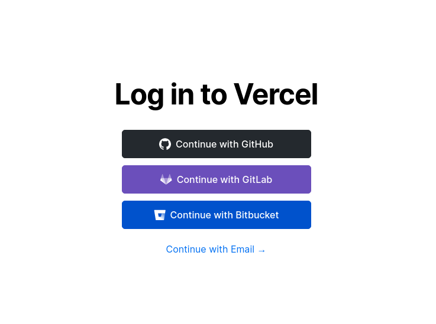
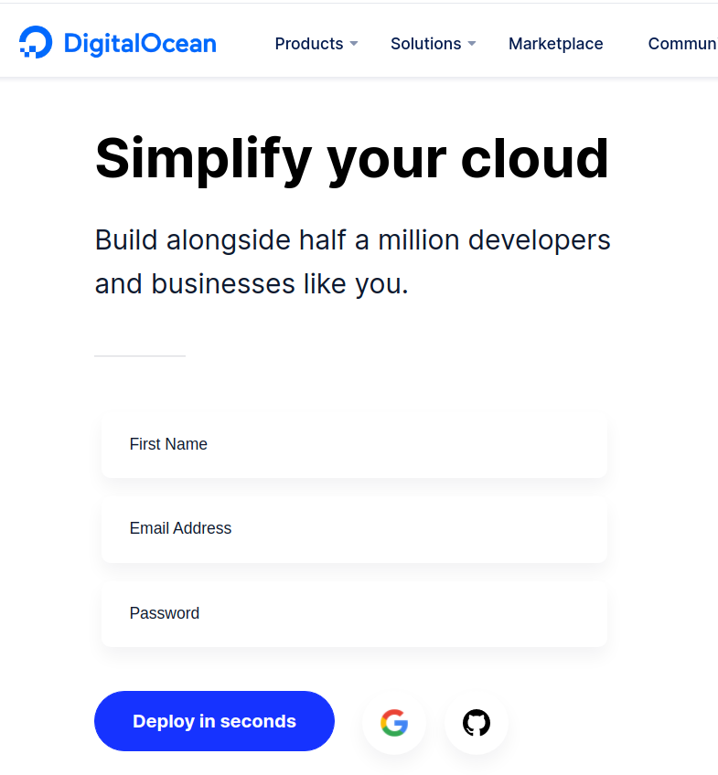

# Create React App NLW - Rocketseat - com Diego Fernandes 
[https://github.com/rocketseat-content](https://github.com/rocketseat-content)
Meu nome é Paulo Alexandre sou de denvolvedor Mumps/Java/Python/ e agora React :D ...
já participei de outras semanas de conteudo da rocketseat mas essa foi fantastica ...
espero conseguir realizar todos os meus desafios pessoais  

## Desenvolvendo aplicação o que foi que eu usei !
Projeto realizado na semana da NLW da Rocketseat
Trilha 2 ReactJS projeto LetMeAsk 
- anotações Notion
- ver o design Figma
- Icones e ideias de css tailwindcss.com (vou tentar utilizar essa biblioteca junto)
### Ambiente:
- Linux mint 20 
- Docker CE version 20.10.6, build 370c289
- Visual Studio Code 1.57.2
- Devcontainer (https://code.visualstudio.com/docs/remote/containers)
- NodeJs 14
- React 
- projeto da semana ...

### Deploys
- [X] firebase ( realizado pela semana ) 
- [X] Vercel (https://vercel.com)
- [X] DigitalOcean (https://cloud.digitalocean.com)

### Desafios que estão sendo implementados por mim nesse projeto no momento ...
- [ ] um controle de admin pra quem loga e cria a sala
- [ ] logout 
- [ ] theme escuro e claro
- [ ] lista de salas disponiveis 
- [X] servidores disponiveis para mesma base de dados (firebase)
- [ ] toasts de alerta
- [ ] modal de deleção ou outras funcionalidades!
- [ ] responsividade
-  

# Deploy em varias plataformas
### pequeno tutorial para ajudar a quem nunca fez deploys or ai!
## Instalando no firebase
Seguindo as orientações do Diego cria sua conta no Google 
na verdade é so logar com sua conta !!!
 https://firebase.google.com/
 
```
# dentro do projeto 

yarn global add firebase-tools

# root ➜ /workspaces/perguntaria/letmeask (master) $ firebase init
#
     ######## #### ########  ######## ########     ###     ######  ########
     ##        ##  ##     ## ##       ##     ##  ##   ##  ##       ##
     ######    ##  ########  ######   ########  #########  ######  ######
     ##        ##  ##    ##  ##       ##     ## ##     ##       ## ##
     ##       #### ##     ## ######## ########  ##     ##  ######  ########

# You're about to initialize a Firebase project in this directory:

firebase login

#
# Confirme a autenticação no google 
#

firebase init

#? What do you want to use as your public directory? public
#? Configure as a single-page app (rewrite all urls to /index.html)? Yes
#? Set up automatic builds and deploys with GitHub? No
#? File public/index.html already exists. Overwrite? Yes

# eu fiz a copia dos arquivos para diretorio public do deploy para subir para firebase

rsync -a deploy/ public/

firebase deploy
# enjoy 
```
## Instalando na Vercel 
Quem ainda não utilizou os serviços da vercel é uma "delicinha" 
crie sua conta na vercel faça a autenticação pelo git hub para vc ter acesso 
ao projetos q vc grava aqui !
- 

Tudo grafico sem muitos problemas 
- Dashboard >> New Project
- Import git Repository
     - escolha sua conta do git hub (caso nao apareca)
     - acesse pelo github 
     - abra profile no avatar selecione settings
     - aplications >> Installed gitHub Apps >> configure
     - 
     - selecione o repositorio para liberação ou deixe aparecer todos os repositorios 
     - 
- Select Vercel Scope (personal account)
- informe o diretorio da aplicação e pronto aguarde o deploy
- Provavelmente vc vai precisar editar o projeto e colocar suas variaveis de ambiente 

- Pronto por aqui é só isso 


## Instalando na DigitalOcean
A digitalocean tambem tem hospedagem gratuita de projetos e auto identificou tudo
Basta ter uma conta na digital DigitalOcean e seguir esses passos

- acesse sua conta eu uso google mas eles tem github tambem 
- no menu lateral escolha opção Apps que esta marcada até hoje 25/06/2021 como new
- click em create app
- selecione o repositorio github >> projeto >> branch >> next 

- caso não aparece é o mesmo problema da vercel tem autorizar
- no meu caso precisei escolher o diretorio por causa do devcontainer
- defina suas variaveis de ambiente 

bom espero ter ajudado vocês bom trabalho

- pacalexandre@gmail.com


